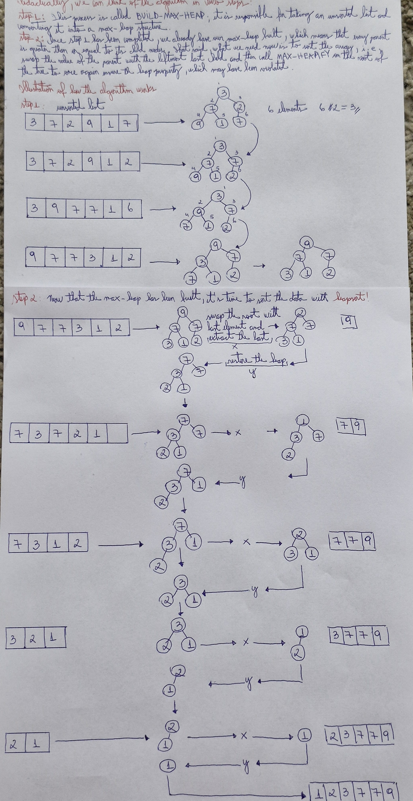

# 📝 Heap Sort Proof

## 📚 Metadata
- **Creator / Inventor**: J. W. J. Williams (he also invented the heap structure)
- **Country of Origin**: England
- **Institution (if applicable)**: King's College, University of London.
- **Year of Creation / Publication**: Williams introduced the heap specifically to support the Heapsort algorithm, which was also
 described in that same paper (Communications of the ACM, July 1964). 

## 📝 Description
Input: A sequence of n number (a1, a2, ..., an)
Output: A permutation (a'1,a'2, ..., a'n) such that a'1 <= a'2 <= ... <= a'n
In other words, reording an array of numbers in decreasing or increasing way

## 📝 Pseudocode
cpp
``` 
BUILD-MAX-HEAP(A,n)
1   A.heap-size = n
2   for i = [n/2] downto 1
3       MAX-HEAPIFY(A,i) 

HEAPSORT(A,n)
1   BUILD-MAX-HEAP(A,n)
2   for i = n downto 2
3       exchange A[1] with A[i]
4       A.heap_size = A.heap_size - 1
        MAX-HEAPIFY(A,1)

```

## ✅ Proof Checklist
- [x] Invariant  
- [x] Correctness  
- [x] Termination  
- [x] Time Complexity  
- [x] Space Complexity  
- [x] Additional Notes  
- [x] Handwritten Draft (optional)  

---

## 1. Invariant
At the start of each interation of the **for** of lines 2-3, each node i + 1, i +2, ..., n is the root of a max-heap.

---

## 2. Correctness
Children of node i are numbered higher than i. By the looping invariant, they are both roots of max-heaps. 
This is precisely the condition required for the call [MAX-HEAPIFY(A,i)](/python/data_structures/heap/README.md) to make node i
a max-heap root.

---

## 3. Termination
The loop makes exatly [n/2] iterations, and so it terminates. 

---

## 4. Time Complexity
| Case        | Complexity |
|-------------|------------|
| Best Case   | O(n log n) |
| Average     | O(n log n) |
| Worst Case  | O(n log n) |
| Space       | O(1)       |

---

## 5. Space Complexity

| Aspect           | Complexity |
|------------------|------------|
| Auxiliary Space  | O(1)       |
| In-Place?        | Yes        |
| Stability        | No         |

---

## 6. Additional Notes
Advantages: always run on O(n log n) and uses justs O(1) space.
Disavantages: It is not stable, that means it doesn't preserve the ordem of the entrance elements.

---

## 7. 📷 Handwritten Draft (optional)
My initial handwritten proof draft is available here:  

