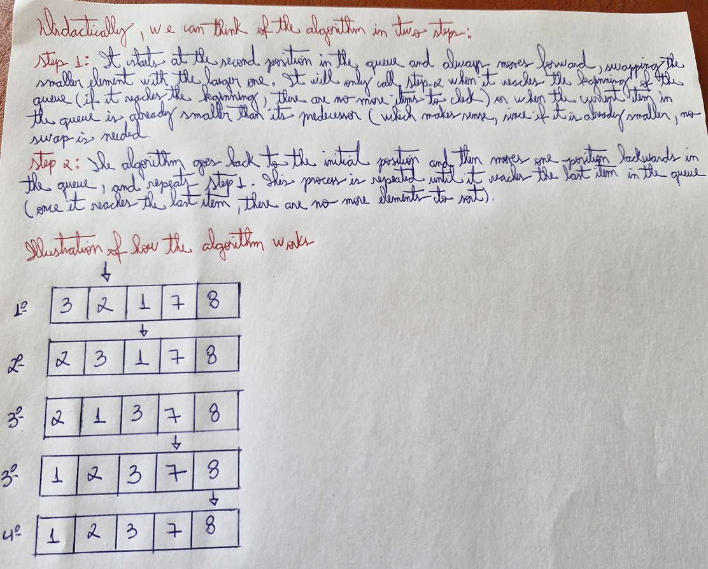

# 📝 Insertion Sort Proof

## 📚 Metadata
- **Creator / Inventor**: Origin uncertain
- **Country of Origin**: N/A
- **Institution (if applicable)**: N/A 
- **Year of Creation / Publication**: Method known since 1940s; formally documented in Donald Knuth’s *The Art of Computer Programming* (1968). 

## 📝 Description
Input: A sequence of n number (a1, a2, ..., an)
Output: A permutation (a'1,a'2, ..., a'n) such that a'1 <= a'2 <= ... <= a'n
In other words, reording an array of numbers in decreasing or increasing way

## 📝 Pseudocode
cpp
``` 
INSERTION-SORT (A, n)
1    for i = 2 to n
2        key = A[i]
4        j = i - 1
5        while j > 0 and A[j] > key
6           A[j + 1] = A[j]
7           j = j - 1
8        A[j + 1] = key

```

## ✅ Proof Checklist
- [x] Invariant  
- [x] Correctness  
- [x] Termination  
- [x] Time Complexity  
- [x] Space Complexity  
- [x] Additional Notes  
- [x] Handwritten Draft (optional)  

---

## 1. Invariant
Before each i, the subarray A[0..i-1] is sorted.

---

## 2. Correctness
At the end, the entire array A[0..n-1] is sorted.

---

## 3. Termination
The outer loop runs n-1 times and stops.

---

## 4. Time Complexity
| Case        | Complexity |
|-------------|------------|
| Best Case   | O(n)       |
| Average     | O(n²)      |
| Worst Case  | O(n²)      |
| Space       | O(1)       |

---

## 5. Space Complexity

| Aspect           | Complexity |
|------------------|------------|
| Auxiliary Space  | O(1)       |
| In-Place?        | Yes        |
| Stability        | Stable     |

---

## 6. Additional Notes
- This algorithm is efficient only for small inputs

---

## 7. 📷 Handwritten Draft (optional)
My initial handwritten proof draft is available here:  
