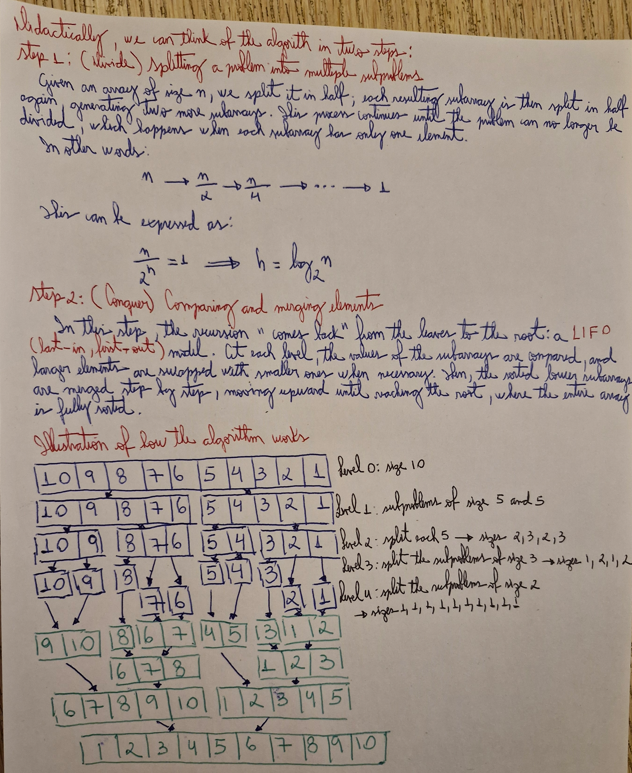

# 📝 Merge Sort Proof

## 📚 Metadata
- **Creator / Inventor**:  John von Neumann
- **Country of Origin**: Hungary
- **Institution (if applicable)**: University of Göttingen 
- **Year of Creation / Publication**: (Divide-and-conquer) Method known since 1945; A detailed description and analysis of bottom-up merge sort appeared in a report by Goldstine and von Neumann as early as 1948. 

## 📝 Description
Type: Divide-and-conquer
Input: A sequence of n number (a1, a2, ..., an)
Output: A permutation (a'1,a'2, ..., a'n) such that a'1 <= a'2 <= ... <= a'n
In other words, recording an array of numbers in decreasing or increasing way

## 📝 Pseudocode
cpp
``` 
A = array 
q = begin
p = middle 
r = end 

MERGE(A, p, q, r)
1   NL = q - p + 1      // length of A[p:q]
2   NR = r - 1          // length of A[q + 1: r]
4   let L[0:NL - 1] and R[0:NR -1] be new arrays
5   for i = 0 to NL - 1 // copy A[p:q] into L[0:NL -1]
6       L[i] = A[p + i]
7   for j = 0 to NR - 1 // copy A[q + 1: r] into R[0:NR -1]
8       R[j] = A[q + j + 1] 
9   i = 0   // i indexes the smallest remaining element in L
10  j = 0   // j indexes the smallest remaining element in R
11  k = p   // k indexes the location in A to fill
12  
13  // As long as each of the arrays L and R contains an unmerged element,
14  // copy the smallest unmerged element back into A[p:r]
15  while i < NL and j < NR
16      if L[i]  <= R[j]
17          A[k] = L[i]
18          i = i + 1
19      else A[k] = R[j]
20          j = j + 1
21      k = k + 1
22  // Having gone through  one of L and R entirely, copy the
23  // remainder of the other to the end of A[p:r]
24  while i < NL
25      A[k] = l[i]
26      i = i + 1
27      k = K + 1
28  while j < NR
29      A[k] = R[j]
30      j = J + 1
31      K = K + 1

```

## ✅ Proof Checklist
- [x] Invariant  
- [x] Correctness  
- [x] Termination  
- [x] Time Complexity  
- [x] Space Complexity  
- [x] Additional Notes  
- [x] Handwritten Draft (optional)  

---

## 1. Invariant
Before each i, the subarray A[0..i-1] is sorted.

---

## 2. Correctness
At the end, the entire array A[0..n-1] is sorted.

---

## 3. Termination
The outer loop runs n-1 times and stops.

---

## 4. Time Complexity
| Case        | Complexity |
|-------------|------------|
| Best Case   | O(n log n) |
| Average     | O(n log n) |
| Worst Case  | O(n log n) |
| Space       | O(n)       |

---

## 5. Space Complexity

| Aspect           | Complexity |
|------------------|------------|
| Auxiliary Space  | O(n)       |
| In-Place?        | No         |
| Stability        | Yes        |

---

## 6. Additional Notes
- This algorithm guarantees O(n log n) time in all cases (best, average, and worst).

---

## 7. 📷 Handwritten Draft (optional)
My initial handwritten proof draft is available here:  
