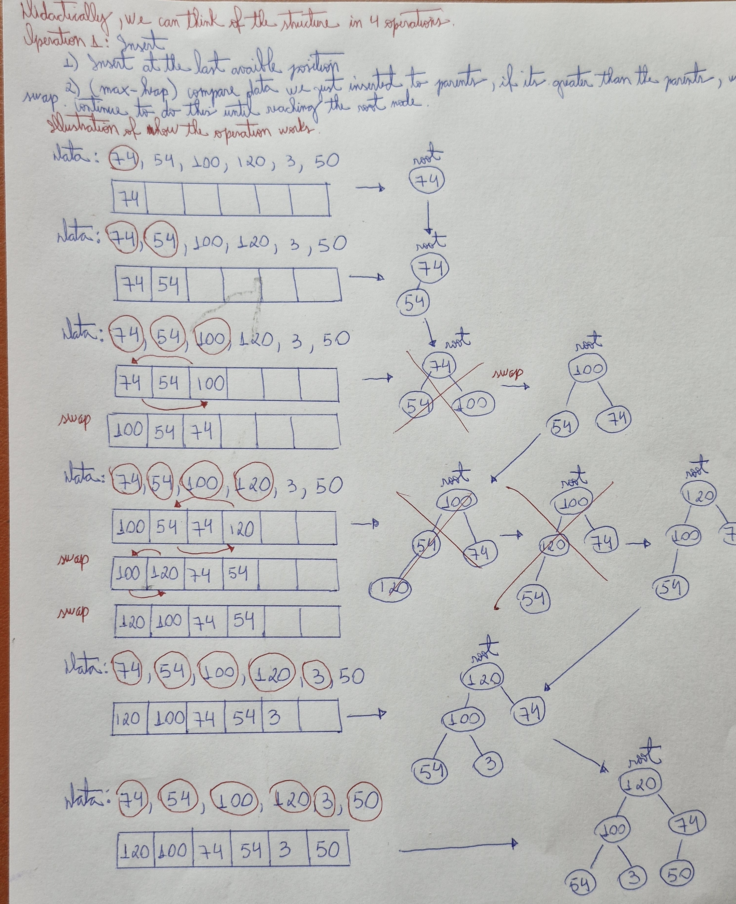
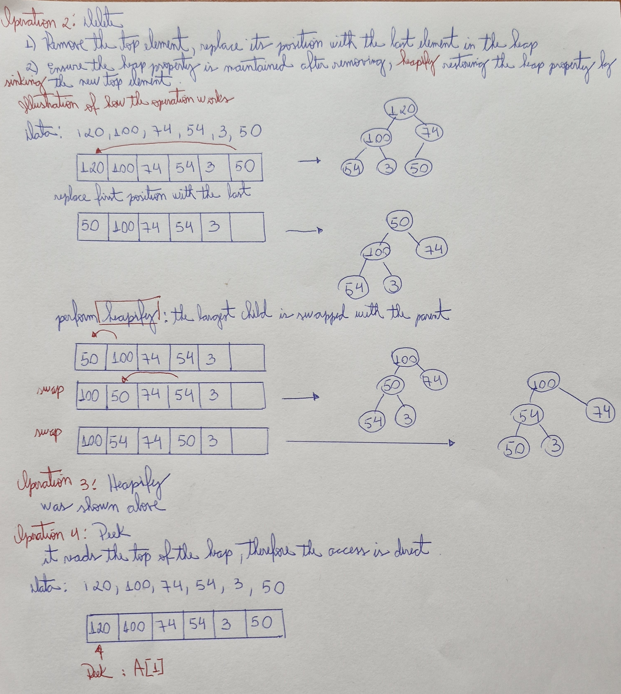

# 📝 Binary Heap Proof

## 📚 Metadata
- **Creator / Inventor**:  J. W. J. Williams
- **Country of Origin**: England
- **Institution (if applicable)**: King's College, University of London.
- **Year of Creation / Publication**: Williams introduced the heap specifically to support the Heapsort algorithm, which was also
 described in that same paper (Communications of the ACM, July 1964). 

## 📝 Description
Type: Data Structure
Input: A sequence of n number (a1, a2, ..., an)
Min-Heap
Output: A permutation (a'1,a'2, ..., a'n) such that a'1 <= a'2 <= ... <= a'n
Constraints: PARENT[i] >= LEFT[2 * i] and PARENT[i] >= RIGHT[2 * i + 1]
Max-Heap
Output: A permutation (a'1,a'2, ..., a'n) such that a'1 >= a'2 >= ... >= a'n
Constraints: PARENT[i] <= LEFT[2 * i] and PARENT[i] <= RIGHT[2 * i + 1]
In other words, recording an array of numbers in decreasing or increasing way


## 📝 Pseudocode
cpp
``` 
A = array of integers 
i = index of array 

PARENT(i) 
    return i / 2  
LEFT(i) 
    return 2i 
RIGHT(i) 
    return 2i + 1

MAX-HEAPIFY(A,i)
    l = LEFT(i) # get index node in the left 
    r = RIGHT(I) # get index node in the right

    if l <= A.heap_size and A[l] > A[i] 
        largest = l # if l is the index that has the value biggest than its parent, then set l as the largest index 
    else largest = i # if not, it means that the largest keep being i

    if r <= A.heap_size and A[r] > A[largest]
        largest = r # if r is the index that has the value biggest than the left or its parent, then set r as the largest index
    if largest != i # that means that the index that is the parent doesn't have the largest value, then the exchange must be done 
        exchange A[i] with A[largest] # exchange the parent with the largest one, the largest can be the left node or the right node
        MAX-HEAPIFY(A,largest)  

# ===== Build heap from arbitrary array =====
BUILD-MAX-HEAP(A,n)
    A.heap_size = n
    for i = [n /2] downto 1 
        MAX-HEAPIFY(A,i)

# ===== Priority-Queue operations on heap =====
HEAP-MAXIMUM(A):
    # assumes A.heap_size >= 1
    return A[1]

HEAP-EXTRACT-MAX(A):
    if A.heap_size < 1:
        error "heap underflow"
    max = A[1]
    A[1] = A[A.heap_size]
    A.heap_size = A.heap_size - 1
    MAX-HEAPIFY(A, 1)
    return max

HEAP-INCREASE-KEY(A, i, key):
    # key must be >= current A[i]
    if key < A[i]:
        error "new key is smaller than current key"
    A[i] = key
    # bubble-up while parent is smaller
    while i > 1 and A[PARENT(i)] < A[i]:
        SWAP(A, i, PARENT(i))
        i = PARENT(i)

MAX-HEAP-INSERT(A, key):
    A.heap_size = A.heap_size + 1
    A[A.heap_size] = -infinity
    HEAP-INCREASE-KEY(A, A.heap_size, key)

```

## ✅ Proof Checklist
- [x] Invariant  
- [x] Correctness  
- [x] Termination  
- [x] Time Complexity  
- [x] Space Complexity  
- [x] Additional Notes  
- [x] Handwritten Draft (optional)  

---

## 1. Invariant
Before the first iteration, we have called BUILD-MAX-HEAP.
So A[1..n] is a max-heap, and A[n+1..n] is empty (vacuously sorted).

---

## 2. Correctness
- Swap A[1] (largest element) with A[heap_size].
- Now the largest element is at the end of the array (A[heap_size]).
- Decrease heap_size by 1.
- Call MAX-HEAPIFY(A,1) to restore the heap property.
- Result: A[1..heap_size] is a max-heap again, and A[heap_size+1..n] is sorted.

---

## 3. Termination
- When heap_size = 1, the subarray A[2..n] is sorted, and trivially A[1] is the smallest remaining element.
- So the whole array A[1..n] is sorted.

---

## 4. Time Complexity
Operation                 | Complexity    |
|-------------------------|---------------|
| Insert(push)            | O(log n)      |
| Extract-Max /Min (pop)  | O(log n)      |
| Peek                    | O(1)          |
| Heapify                 | O(log n)      |
| Build-Heap              | O(n)          |

---

## 5. Space Complexity

| Aspect           | Complexity |
|------------------|------------|
| Auxiliary Space  | O(1)       |
| In-Place?        | Yes        |
| Stability        | No         |

---

## 6. Additional Notes
- Heap as a data structure is also not stable (because it does not preserve the order among equal elements (in heap duplicates are allowed)).

---

## 7. 📷 Handwritten Draft (optional)
My initial handwritten proof draft is available here:  

